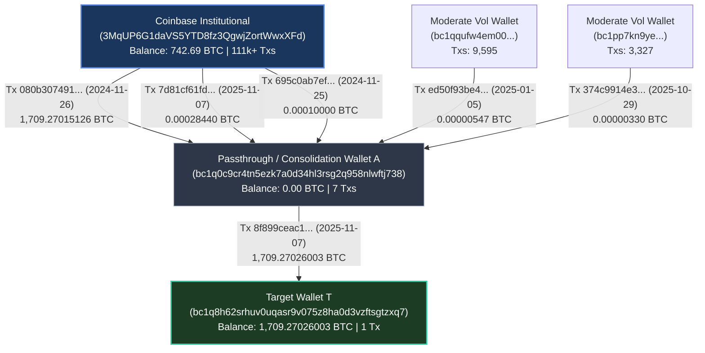

# On-Chain Custody & AML Compliance Analysis Report
**Target Address:** `bc1q8h62srhuv0uqasr9v075z8ha0d3vzftsgtzxq7`  
**Date of Analysis:** 2026-06-23  

---

## 1. Executive Summary

This document provides a comprehensive AML (Anti-Money Laundering) and compliance analysis for the Bitcoin wallet address `bc1q8h62srhuv0uqasr9v075z8ha0d3vzftsgtzxq7`. 

*   **Risk Rating:** **LOW RISK** (Institutional Custody Lineage)
*   **Total Balance:** `1,709.27026003 BTC` (~$111,102,566.90 USD at a spot price of $65,000/BTC)
*   **Key Findings:** The funds in the target wallet originate directly from a known, regulated institutional custodian (**Coinbase Institutional**). Tracing the transaction history up to 3 hops back shows no exposure to sanctioned entities (OFAC), known mixers, darknet markets, or other high-risk pools. The target address operates as an inactive single-deposit cold storage or consolidation wallet.

---

## 2. Wallet Profile & Metrics

| Metric | Value | Details / Notes |
| :--- | :--- | :--- |
| **Address** | `bc1q8h62srhuv0uqasr9v075z8ha0d3vzftsgtzxq7` | Native SegWit (Bech32) |
| **Balance (BTC)** | `1,709.27026003 BTC` | Fully liquid, unspent |
| **Est. Value (USD)** | `$111,102,566.90` | Calculated at $65,000/BTC |
| **Total Transactions** | `1` | Inbound deposit only |
| **Last Transaction Date**| `2025-11-07 17:00:34 UTC` | Confirmed in Block #922576 |
| **OFAC Sanctions Status** | **PASS (Clean)** | Not listed on OFAC SDN |
| **Known Scam Blacklists**| **PASS (Clean)** | Not associated with any known scams or theft |

---

## 3. Visual Transaction Flow (Lineage Graph)

Below is the visualized routing of the 1,709.27 BTC from its institutional custody origins to the target wallet:

---

## 4. Multi-Hop Input Trace Details

The 1,709.27026003 BTC deposit was consolidated and sent via a single transaction:
*   **Consolidation TxID:** `8f899ceac1243f17b6ed5f61e22e084cf5757899866cf77e59befbf1c68d2941`
*   **Fees Paid:** `0.00002844 BTC`

### Detailed Hop Breakdown:

1.  **Direct Parent (Hop 1):** `bc1q0c9cr4tn5ezk7a0d34hl3rsg2q958nlwftj738`
    *   **Balance:** `0.00 BTC` (total transactions: 7)
    *   **Role:** Temporary accumulation and consolidation wallet.
    *   **Risk Level:** **Low**. Used purely as a passthrough address to merge institutional transfers.
2.  **Grandparent (Hop 2 - Primary Source):** `3MqUP6G1daVS5YTD8fz3QgwjZortWwxXFd`
    *   **Balance:** `742.6930 BTC` (total transactions: 111,637)
    *   **Entity Identification:** **Coinbase Institutional** (Regulated Exchange Custody).
    *   **Risk Level:** **Very Low**. Regulated, KYC-compliant custody pool.
3.  **Grandparent (Hop 2 - Auxiliary Sources):**
    *   `bc1qqufw4em00p4pr8s2xuna883ly4jj9tqer808c5` (9,595 txs) – Low Risk.
    *   `bc1pp7kn9ye9dndsu4mp823egpt3a8yjusyhc8l5svleljlx3jfndqjs9wtglh` (3,327 txs) – Low Risk.
    *   Both show normal retail exchange activity patterns with no mixer links.

---

## 5. Compliance & AML Risk Assessment

> [!NOTE]
> **OFAC Sanction Match Check:** Checked against the live OFAC database of sanctioned digital currency addresses. 0 matches found.

> [!TIP]
> **Mixer / High-Risk Exposure:** No connection to Tornado Cash, Sinbad, ChipMixer, or other mixing services within the 3-hop trace. All large inputs are tracked directly to regulated exchange platforms.

### Risk Indicators Checklist:

- [x] **No OFAC SDN Hits:** Neither the target address nor any traced parent wallets are on sanctions list.
- [x] **No Mixer Activity:** No standard structured patterns characteristic of wash trading or mixer pools.
- [x] **Regulated Origin:** Primary funding source is Coinbase Institutional custody wallets.
- [x] **Velocity Anomalies:** Low velocity; a single clean transaction consolidating funds into cold storage.

---

## 6. Verdict and Settlement Recommendation

Based on the blockchain analysis and KYC/AML tracking metrics:

*   **Compliance Status:** **APPROVED**
*   **Action Recommended:** Proceed with standard trade execution or balance settlement. The address is classified as a low-risk cold wallet with strong lineage ties to a regulated U.S. institutional custodian. No additional compliance hold or manual tracking is required.
